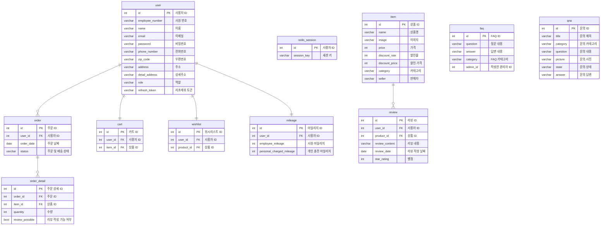

```mermaid
erDiagram
    user {
        int id PK "사용자 ID"
        varchar employee_number "사원 번호"
        varchar name "이름"
        varchar email "이메일"
        varchar password "비밀번호"
        varchar phone_number "전화번호"
        varchar zip_code "우편번호"
        varchar address "주소"
        varchar detail_address "상세주소"
        varchar role "역할"
        varchar refresh_token "리프레쉬 토큰"
    }

    redis_session {
        int id PK "사용자 ID"
        varchar session_key "세션 키"
    }

    item {
        int id PK "상품 ID"
        varchar name "상품명"
        varchar image "이미지"
        int price "가격"
        int discount_rate "할인율"
        int discount_price "할인 가격"
        varchar category "카테고리"
        varchar seller "판매자"
    }

    order {
        int id PK "주문 ID"
        int user_id FK "사용자 ID"
        date order_date "주문 날짜"
        varchar status "주문 및 배송 상태"
    }

    order_detail {
        int id PK "주문 상세 ID"
        int order_id FK "주문 ID"
        int item_id FK "상품 ID"
        int quantity "수량"
        bool review_possible "리뷰 작성 가능 여부"
    }

    cart {
        int id PK "카트 ID"
        int user_id FK "사용자 ID"
        int item_id FK "상품 ID"
    }

    wishlist {
        int id PK "위시리스트 ID"
        int user_id FK "사용자 ID"
        int product_id FK "상품 ID"
    }

    review {
        int id PK "리뷰 ID"
        int user_id FK "사용자 ID"
        int product_id FK "상품 ID"
        varchar review_content "리뷰 내용"
        date review_date "리뷰 작성 날짜"
        int star_rating "별점"
    }

    mileage {
        int id PK "마일리지 ID"
        int user_id FK "사용자 ID"
        int employee_mileage "사원 마일리지"
        int personal_charged_mileage "개인 충전 마일리지"
    }

    faq {
        int id PK "FAQ ID"
        varchar question "질문 내용"
        varchar answer "답변 내용"
        varchar category "FAQ 카테고리"
        int admin_id "작성한 관리자 ID"
    }

    qna {
        int id PK "문의 ID"
        varchar title "문의 제목"
        varchar category "문의 카테고리"
        varchar question "문의 내용"
        varchar picture "문의 사진"
        varchar state "문의 상태"
        varchar answer "문의 답변"
    }

    user ||--o{ order: ""
    order ||--o{ order_detail: ""
    user ||--|| cart: ""
    user ||--|| wishlist: ""
    item ||--o{ review: ""
    user ||--|| mileage: ""
```